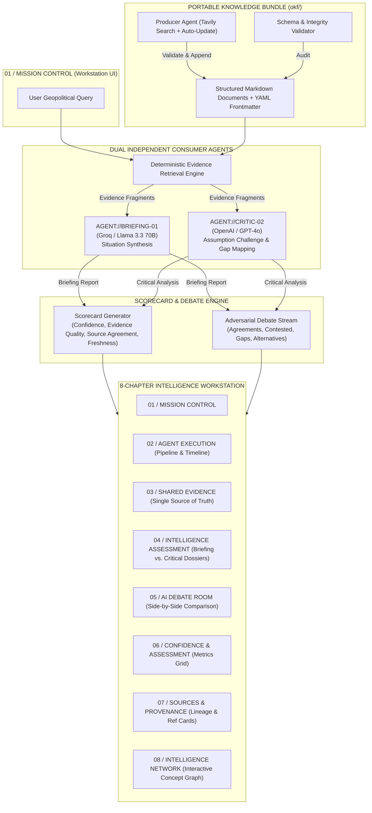

# OKF Intelligence Operations Center — Dual-Agent Geopolitical Intelligence Workstation

[](https://nextjs.org/)
[](https://www.typescriptlang.org/)
[](https://fastapi.tiangolo.com/)
[](https://tailwindcss.com/)
[](https://groq.com/)
[](https://openai.com/)

An open, auditable, **dual-agent intelligence workstation** designed for geopolitical analysis.

Instead of relying on a single AI model or a generic chatbot, OKF dispatches **two independent AI analysts** (a Briefing Agent and a Critical Analysis Agent) to evaluate the exact same verified knowledge bundle, cross-examine evidence, challenge assumptions, and debate findings in real time.

---

## 🎯 The Problem: Why Chatbots & Naive RAG Fail in Critical Analysis

When analyzing high-stakes geopolitical events (conflicts, trade policy, military posture, energy security), standard AI approaches fail for fundamental reasons:

1. **The Single-LLM Blindspot**: A single AI model has inherent training biases and confirmation bias. It presents a smooth, confident narrative that conceals its own assumptions.
2. **Naive RAG Echo Chambers**: Standard Retrieval-Augmented Generation (RAG) pulls documents and feeds them to one prompt. If the retrieved documents contain gaps or contradictions, a single agent will pick one perspective and ignore the conflict.
3. **Lack of Auditability**: Most AI dashboards hide the retrieval process. You get an answer, but you can't easily verify which exact fragment supported which claim, or whether the model invented details.
4. **Chatbot UI Inadequacy**: Chat interfaces force users into a single sequential wall of text. They lack visual structure, metric breakdowns, and side-by-side comparative analysis.

---

## 💡 The Solution: How OKF is Different

OKF shifts the paradigm from a **conversational chatbot** to a **structured intelligence workstation**.

| Feature | Standard RAG / Chatbot | OKF Intelligence Workstation |
|---|---|---|
| **Architecture** | Single LLM model | **Dual Independent Adversarial Agents** (Briefing vs. Critic) |
| **Model Diversity** | Single provider | **Multi-Provider & Multi-Model** (Groq/Llama + OpenAI/GPT-4o) |
| **Auditability** | Black box retrieval | **Immutable Portable Knowledge Layer (`okf/`) + Validation Gate** |
| **Critical Review** | Accepts its own answers | **Adversarial Criticism**: Challenges assumptions & flags gaps |
| **Disagreement Handling** | Hides conflicts | **Dedicated AI Debate Room**: Side-by-side claim vs. challenge |
| **Interface** | Unstructured chat bubbles | **Structured 8-Chapter Workstation UI** with sticky section navigation |
| **Scoring** | No metrics | **Quantitative Scorecards**: Confidence, Evidence Quality, Agreement, Freshness |

---

## 🏗️ Architecture & Workflow



---

## ⚙️ How It Works (Step-by-Step)

### 1. The Portable Knowledge Layer (`okf/`)
The knowledge layer consists of plain Markdown files with YAML frontmatter stored in `okf/` (covering `conflicts/`, `actors/`, `economics/`, and `policy/`). It requires **no vector database or proprietary SDK**. Every document has a stable concept ID, title, tags, and structured sections (`Summary`, `Developments`, `Key Actors`, `Sources`).

### 2. The Producer Agent & Validation Gate
The Python Producer Agent periodically retrieves real-world intelligence updates via Tavily Search, drafts updates using an LLM, and passes them through an automated **Validation Gate**. If a document fails schema or link integrity checks, it is rejected automatically. Prior history is never overwritten.

### 3. Dual Independent Consumer Agents
When a analyst submits a query:
- **`AGENT://BRIEFING-01`** (Groq / Llama 3.3 70B): Focuses on situation synthesis, constructing a grounded executive briefing, key developments, key actors, and initial threat assessment.
- **`AGENT://CRITIC-02`** (OpenAI / GPT-4o): Operates independently to challenge the briefing's assumptions, flag unverified claims, highlight intelligence gaps, and offer alternative interpretations.

### 4. Deterministic Scorecard & Debate Engine
The system compares both outputs deterministically:
- **Confidence Metric**: Ratio of verified vs. unverified evidence fragments.
- **Evidence Quality**: Mean matching score of retrieved evidence (`9.0 / 10` or `90%`).
- **Source Agreement**: Overlap percentage between the documents cited by both agents.
- **Freshness**: Days elapsed since the latest document access date.
- **Debate Stream**: Automatically classifies findings into **Agreements**, **Contested Claims**, **Intelligence Gaps**, and **Alternative Interpretations**.

---

## 🖥️ 8-Chapter Workstation UI Structure

The frontend is structured into **8 numbered visual chapter sections** with a sticky section navigator for smooth, single-click jumping:

1. **`01 / MISSION CONTROL`**: Monospace mission query input, document count selector, dispatch action, and example queries.
2. **`04 / INTELLIGENCE ASSESSMENT`** (*Primary Focal Point Post-Completion*):
   - Two balanced side-by-side columns: **Left = BRIEFING ASSESSMENT** | **Right = CRITICAL ASSESSMENT**.
   - Shorter line lengths, max-widths, structured lists, and clear typography.
3. **`05 / AI DEBATE ROOM`**:
   - Filterable category tabs: `[ EXCHANGE ]`, `[ AGREEMENTS ]`, `[ CONTESTED ]`, `[ GAPS ]`, `[ ALTERNATIVES ]`.
   - Side-by-side claim vs. challenge comparison.
4. **`06 / CONFIDENCE & ASSESSMENT`**:
   - Metrics grid featuring Confidence %, Evidence Quality (`9.0 / 10`), Source Agreement %, and Freshness.
5. **`07 / SOURCES & PROVENANCE`**:
   - Primary source documentation list with external links + compact generation provenance metadata strip.
6. **`03 / SHARED EVIDENCE`**:
   - Single source of truth for full retrieved evidence cards, section anchors, and matching scores.
7. **`02 / AGENT EXECUTION`**:
   - Live 8-step execution pipeline & stream during query processing; collapses into compact status cards post-completion.
8. **`08 / INTELLIGENCE NETWORK`**:
   - Interactive ReactFlow concept network graph with node type legend (`h-[400px]` controlled height).

---

## 🛠️ Technology Stack

### Frontend
- **Framework**: [Next.js 15](https://nextjs.org/) (App Router, React 19)
- **Language**: [TypeScript](https://www.typescriptlang.org/)
- **Styling**: [Tailwind CSS v4](https://tailwindcss.com/) (Command-center dark navy palette, scanline effects, custom glass utilities)
- **Animations**: [Framer Motion](https://www.framer.com/motion/)
- **State & Data Fetching**: [TanStack Query v5](https://tanstack.com/query/latest)
- **Graph Visualization**: [ReactFlow](https://reactflow.dev/)
- **Icons**: [Lucide React](https://lucide.dev/)

### Backend
- **Framework**: [FastAPI](https://fastapi.tiangolo.com/) (Python 3.10+)
- **Validation**: PyDantic v2
- **Server**: Uvicorn

### AI & Intelligence Engines
- **Briefing Agent**: Groq API (`llama-3.3-70b-versatile`)
- **Critical Analysis Agent**: OpenAI API (`gpt-4o` / `gpt-4o-mini`)
- **Search Provider**: Tavily Search API

---

## 🚀 Quickstart Guide

### Prerequisites
- Node.js 18+ and `npm`
- Python 3.10+
- Groq API Key and/or OpenAI API Key
- Tavily API Key (for producer updates)

### 1. Environment Setup

Copy `.env.example` to `.env` in the project root:

```bash
cp .env.example .env
```

Edit `.env` to supply your API keys:

```env
TAVILY_API_KEY=your_tavily_api_key
GROQ_API_KEY=your_groq_api_key
OPENAI_API_KEY=your_openai_api_key
```

### 2. Backend Setup (FastAPI)

```bash
# Create and activate Python virtual environment
python3 -m venv .venv
source .venv/bin/activate  # On Windows: .venv\Scripts\activate

# Install dependencies
pip install -r requirements.txt

# Start FastAPI backend server
uvicorn api.main:app --reload --port 8000
```

The API will be available at `http://localhost:8000` (Swagger docs at `http://localhost:8000/docs`).

### 3. Frontend Setup (Next.js 15 Workstation)

In a new terminal window:

```bash
cd frontend

# Install Node dependencies
npm install

# Start Next.js development server
npm run dev
```

Open `http://localhost:3000` in your browser to launch the **Intelligence Operations Center**.

---

## 📂 Directory Structure

```text
OKF/
├── okf/                        # Portable Knowledge Layer (Plain Markdown + YAML)
│   ├── actors/                 # Geopolitical actors & entities
│   ├── conflicts/              # Active conflict zones & tension points
│   ├── economics/              # Trade, sanctions, and economic data
│   └── policy/                 # Treaties, alliances, and policy documents
├── config/
│   └── tracked_concepts.yaml   # Concept registry & metadata definitions
├── producer/                   # Producer Agent (Tavily search -> LLM update -> Write)
├── validator/                  # Validation Gate (Schema & link integrity auditor)
├── api/                        # FastAPI Backend endpoints (/brief, /analyze, /ready, /version)
├── frontend/                   # Next.js 15 Intelligence Workstation
│   ├── app/                    # App Router (page.tsx, globals.css, layout.tsx)
│   ├── components/             # 8-Chapter Workstation UI components
│   │   ├── section-nav.tsx     # Sticky horizontal chapter navigator
│   │   ├── agent-panel.tsx     # Agent terminal & compact completed cards
│   │   ├── briefing-view.tsx   # Briefing Dossier assessment (Left Column)
│   │   ├── analysis-view.tsx   # Critical Analysis Dossier assessment (Right Column)
│   │   ├── debate-stream.tsx   # AI Debate Room (Exchange, Agreements, Contested, Gaps)
│   │   ├── scorecard.tsx       # Intel Confidence Metrics grid (9.0/10 format)
│   │   ├── sources-list.tsx    # Primary sources list
│   │   ├── meta-footer.tsx     # Compact Generation Provenance strip
│   │   ├── shared-evidence-section.tsx # Single source of truth for evidence
│   │   └── knowledge-graph-panel.tsx   # ReactFlow Concept Graph
│   └── lib/                    # Core client logic (lifecycle, debate, scorecard, graph)
├── tests/                      # Python & Vitest test suites
└── README.md                   # Project documentation
```

---

## 🧪 Testing & Verification

### Backend & Validator Tests
```bash
.venv/bin/python -m unittest discover -s tests
.venv/bin/python -m validator validate okf
```

### Frontend Type Checking & Unit Tests
```bash
cd frontend
npx tsc --noEmit
npm run test:run
```

---

## 🔒 Security & Auditability Guarantee

- **Zero Fabricated Evidence**: Every claim presented by both agents is tied directly to real Markdown source files in `okf/`.
- **Atomic Validation Writes**: The Producer Agent can never corrupt the knowledge layer. Updates pass through the Validation Gate before writing.
- **Git Auditability**: Because the knowledge layer is stored in plain Git, every change, addition, or edit to intelligence documents is fully version-controlled and diffable.

---

## 📄 License

Distributed under the MIT License. See `LICENSE` for more information.
