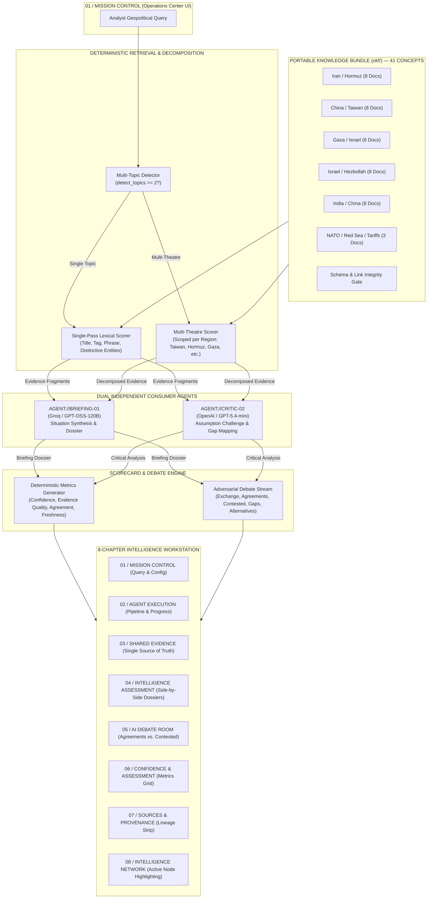

# OKF Intelligence Operations Center — Dual-Agent Geopolitical Intelligence Workstation

[](https://nextjs.org/)
[](https://www.typescriptlang.org/)
[](https://fastapi.tiangolo.com/)
[](https://tailwindcss.com/)
[](https://groq.com/)
[](https://openai.com/)
[](https://pytest.org/)
[](https://vitest.dev/)

An open, verifiable, **dual-agent geopolitical intelligence workstation** engineered for high-stakes strategic analysis.

Instead of relying on a single AI model or a generic conversational chatbot, OKF dispatches **two independent, adversarial AI agents**—a **Briefing Agent** (Groq / OSS 120B) and a **Critical Analysis Agent** (OpenAI / GPT-5.4-mini)—to analyze the exact same immutable, verified knowledge bundle, cross-examine evidence, challenge assumptions, and debate findings in real time.

---

## 📑 Table of Contents

- [The Problem: Why Chatbots & Naive RAG Fail](#-the-problem-why-chatbots--naive-rag-fail)
- [The Solution: How OKF is Different](#-the-solution-how-okf-is-different)
- [System Architecture & Workflow](#-system-architecture--workflow)
- [Core Subsystems](#-core-subsystems)
  - [1. Portable Geopolitical Knowledge Bundle (`okf/`)](#1-portable-geopolitical-knowledge-bundle-okf)
  - [2. Deterministic Lexical Retrieval & Multi-Theatre Decomposition](#2-deterministic-lexical-retrieval--multi-theatre-decomposition)
  - [3. Dual-Consumer Analysis Pipeline](#3-dual-consumer-analysis-pipeline)
  - [4. Scorecard & Adversarial Debate Engine](#4-scorecard--adversarial-debate-engine)
  - [5. Intelligence Network Graph (ReactFlow & REST API)](#5-intelligence-network-graph-reactflow--rest-api)
  - [6. Codebase Knowledge Graph (`.graphify`)](#6-codebase-knowledge-graph-graphify)
- [8-Chapter Operations Center UI](#-8-chapter-operations-center-ui)
- [Technology Stack](#-technology-stack)
- [Quickstart Guide](#-quickstart-guide)
  - [Prerequisites](#prerequisites)
  - [1. Environment Configuration](#1-environment-configuration)
  - [2. Backend Setup (FastAPI)](#2-backend-setup-fastapi)
  - [3. Frontend Setup (Next.js 15 Workstation)](#3-frontend-setup-nextjs-15-workstation)
- [Testing & Quality Assurance](#-testing--quality-assurance)
- [Directory Structure](#-directory-structure)
- [Security & Auditability Guarantee](#-security--auditability-guarantee)
- [License](#-license)

---

## 🎯 The Problem: Why Chatbots & Naive RAG Fail

When analyzing high-stakes geopolitical events (military posture, chokepoint blockades, supply chain vulnerabilities, territorial disputes), standard AI approaches fail for fundamental reasons:

1. **The Single-LLM Blindspot**: A single AI model has inherent training biases and confirmation bias. It presents a smooth, confident narrative that conceals its own assumptions.
2. **Naive RAG Echo Chambers & Vector Drift**: Vector embeddings and fuzzy semantic search frequently retrieve documents that "sound similar" while missing critical factual distinctions (e.g. confusing the Taiwan Strait with the Strait of Hormuz due to the word "strait").
3. **Multi-Theatre Query Starvation**: In complex comparative queries covering multiple regions, naive global retrieval lets the highest-scoring single topic monopolize all slots, starving other critical theatres of evidence.
4. **Lack of Provenance & Auditability**: Standard AI dashboards hide retrieval mechanics. Analysts cannot verify which exact paragraph supported a claim or whether the model fabricated details.
5. **Chatbot UI Inadequacy**: Unstructured conversational bubbles are inefficient for strategic intelligence. They lack side-by-side comparative views, verifiable confidence metrics, and topological network insights.

---

## 💡 The Solution: How OKF is Different

OKF shifts the paradigm from a **conversational chatbot** to an **auditable, dual-agent intelligence workstation**:

| Dimension | Standard RAG / Chatbot | OKF Intelligence Operations Center |
|---|---|---|
| **Architecture** | Single LLM model | **Dual Independent Adversarial Agents** (Briefing vs. Critic) |
| **Model Diversity** | Single provider | **Multi-Provider & Multi-Model** (Groq / OSS 120B + OpenAI / GPT-5.4-mini) |
| **Knowledge Store** | Proprietary Vector DB / Hidden Embeddings | **Immutable Portable Knowledge Layer (`okf/`) + Plain Markdown & YAML** |
| **Retrieval Engine** | Fuzzy vector similarity (drift-prone) | **Deterministic Lexical Engine + Multi-Theatre Query Decomposition** |
| **Cross-Contamination Guard** | None (semantic overlap causes leakage) | **Entity Weighting & Dynamic Precision Cutoff (`cutoff = max(4, 0.35 * top)`)** |
| **Critical Review** | Accepts its own generated text | **Adversarial Critique**: Challenges assumptions & identifies intelligence gaps |
| **Conflict Resolution** | Suppresses contradictions | **Dedicated AI Debate Room**: Side-by-side claim vs. challenge breakdown |
| **Interface** | Sequential chat bubbles | **Structured 8-Chapter Workstation UI** with sticky section navigation |
| **Scoring & Metrics** | Qualitative text only | **Quantitative Scorecards**: Confidence %, Evidence Quality (`9.0/10`), Agreement %, Freshness |
| **Network Visualization** | None | **Live Concept Graph + `.graphify` Codebase AST Knowledge Graph** |

---

## 🏗️ System Architecture & Workflow


```mermaid
graph TD
    subgraph UI ["01 / MISSION CONTROL (Operations Center UI)"]
        UserQuery["Analyst Geopolitical Query"]
    end

    subgraph RETRIEVAL_ENGINE ["DETERMINISTIC RETRIEVAL & DECOMPOSITION"]
        TopicDetector["Multi-Topic Detector\n(detect_topics >= 2?)"]
        SingleLexical["Single-Pass Lexical Scorer\n(Title, Tag, Phrase, Distinctive Entities)"]
        MultiLexical["Multi-Theatre Scorer\n(Scoped per Region: Taiwan, Hormuz, Gaza, etc.)"]
        TopicDetector -->|Single Topic| SingleLexical
        TopicDetector -->|Multi-Theatre| MultiLexical
    end

    subgraph KNOWLEDGE_LAYER ["PORTABLE KNOWLEDGE BUNDLE (okf/) — 41 CONCEPTS"]
        Hormuz["Iran / Hormuz (8 Docs)"]
        Taiwan["China / Taiwan (8 Docs)"]
        Gaza["Gaza / Israel (8 Docs)"]
        Lebanon["Israel / Hezbollah (8 Docs)"]
        IndiaChina["India / China (8 Docs)"]
        Context["NATO / Red Sea / Tariffs (3 Docs)"]
        Validator["Schema & Link Integrity Gate"]
    end

    subgraph DUAL_AGENTS ["DUAL INDEPENDENT CONSUMER AGENTS"]
        BriefingAgent["AGENT://BRIEFING-01\n(Groq / GPT-OSS-120B)\nSituation Synthesis & Dossier"]
        CriticAgent["AGENT://CRITIC-02\n(OpenAI / GPT-5.4-mini)\nAssumption Challenge & Gap Mapping"]
    end

    subgraph COMPARISON_ENGINE ["SCORECARD & DEBATE ENGINE"]
        Scorecard["Deterministic Metrics Generator\n(Confidence, Evidence Quality, Agreement, Freshness)"]
        DebateStream["Adversarial Debate Stream\n(Exchange, Agreements, Contested, Gaps, Alternatives)"]
    end

    subgraph WORKSTATION ["8-CHAPTER INTELLIGENCE WORKSTATION"]
        Sec01["01 / MISSION CONTROL (Query & Config)"]
        Sec02["02 / AGENT EXECUTION (Pipeline & Progress)"]
        Sec03["03 / SHARED EVIDENCE (Single Source of Truth)"]
        Sec04["04 / INTELLIGENCE ASSESSMENT (Side-by-Side Dossiers)"]
        Sec05["05 / AI DEBATE ROOM (Agreements vs. Contested)"]
        Sec06["06 / CONFIDENCE & ASSESSMENT (Metrics Grid)"]
        Sec07["07 / SOURCES & PROVENANCE (Lineage Strip)"]
        Sec08["08 / INTELLIGENCE NETWORK (Active Node Highlighting)"]
    end

    UserQuery --> TopicDetector
    KNOWLEDGE_LAYER --> SingleLexical
    KNOWLEDGE_LAYER --> MultiLexical
    SingleLexical -->|Evidence Fragments| BriefingAgent
    SingleLexical -->|Evidence Fragments| CriticAgent
    MultiLexical -->|Decomposed Evidence| BriefingAgent
    MultiLexical -->|Decomposed Evidence| CriticAgent

    BriefingAgent -->|Briefing Dossier| Scorecard
    CriticAgent -->|Critical Analysis| Scorecard
    BriefingAgent -->|Briefing Dossier| DebateStream
    CriticAgent -->|Critical Analysis| DebateStream

    Scorecard --> WORKSTATION
    DebateStream --> WORKSTATION
```

---

## 🧩 Core Subsystems

### 1. Portable Geopolitical Knowledge Bundle (`okf/`)
The knowledge layer consists of plain Markdown files with YAML frontmatter in `okf/`—requiring **no vector database, external vector index, or proprietary SDK**.

The bundle encompasses **41 verified intelligence concepts** and **129 relationship edges** across 5 primary escalation clusters and strategic context documents:

1. **Iran / Strait of Hormuz (8 Documents)**:
   - `strait-of-hormuz-maritime-tensions`: Maritime security posture, tanker escorting, mining risks.
   - `hormuz-oil-transit-chokepoint`: ~21M bpd oil flow, crude transit vulnerabilities, economic impact.
   - `irgc-navy-gulf-posture`: Fast-attack craft swarming, anti-ship missile batteries, asymmetric tactics.
   - `us-fifth-fleet-bahrain-operations`: Combined Maritime Forces (CMF), IMSC Sentinel, defensive posture.
   - `iran-nuclear-enrichment-status`: HEU stockpiles, IAEA safeguards, breakout timeline monitoring.
   - `gulf-states-security-hedging`: GCC diplomatic balancing (Saudi-Iran rapprochement, UAE trade ties).
   - `iran-oil-export-sanctions-evasion`: Dark fleet logistics, ship-to-ship transfers, destination tracking.
   - `strait-of-hormuz-alternative-pipelines`: Petroline, Abu Dhabi bypass, capacity vs. demand bottlenecks.
2. **China / Taiwan (8 Documents)**:
   - `taiwan-strait-military-tensions`: Gray-zone ADIZ incursions, median line erasure, joint blockade rehearsals.
   - `taiwan-semiconductor-global-supply-chain`: TSMC advanced packaging, global silicon supply vulnerability.
   - `china-taiwan-reunification-policy`: White paper commitments, Anti-Secession Law, timeline signals.
   - `indo-pacific-taiwan-regional-alignment`: US-Japan-Philippines trilateral coordination, deterrence postures.
   - `taiwan-porcupine-defense-strategy`: Asymmetric sea-denial, mobile Harpoon batteries, civil defense reserves.
   - `pla-air-sea-blockade-capabilities`: Maritime quarantine exercises, joint strike group deployment.
   - `us-taiwan-relations-act-deterrence`: Strategic ambiguity, Foreign Military Financing, Taiwan Assurance Act.
   - `first-island-chain-defense-architecture`: Anti-access/area-denial (A2/AD), missile rings, base dispersion.
3. **Gaza / Israel (8 Documents)**:
   - `gaza-humanitarian-crisis-infrastructure`: Water, power, medical infrastructure damage, food insecurity.
   - `gaza-military-operations-security`: IDF urban operations, combat dynamics, buffer zone creation.
   - `us-diplomatic-involvement-gaza`: UNSC veto posture, humanitarian pier, ceasefire diplomatic tracks.
   - `israel-domestic-political-cleavages`: War cabinet dynamics, judicial/electoral tensions, public pressure.
   - `hamas-military-command-posture`: Asymmetric underground tunnel network, cell reorganization.
   - `gaza-post-war-governance-frameworks`: Day-after proposals, Palestinian Authority vs. international forces.
   - `philadelphi-corridor-border-control`: Egypt-Gaza border security, smuggling tunnel interdiction.
   - `qatar-egypt-ceasefire-mediation`: Hostage release negotiations, diplomatic backchannels.
4. **Israel / Hezbollah / Lebanon (8 Documents)**:
   - `israel-lebanon-border-conflict`: Cross-border rocket artillery, Northern Israel displacement, IDF strikes.
   - `hezbollah-military-arsenal-posture`: Precision-guided munitions, anti-tank guided missiles, UAV fleets.
   - `unscr-1701-disarmament-framework`: UNIFIL mandate, Litani River demilitarization compliance issues.
   - `lebanon-economic-collapse-state-capacity`: Currency devaluation, institutional paralysis, governance strain.
   - `idf-northern-command-operations`: Northern frontier readiness, active defense, counter-battery targeting.
   - `iran-axis-of-resistance-coordination`: IRGC Quds Force logistics corridor via Syria and Iraq.
   - `radwan-force-border-operations`: Specialized commando training, infiltration tactics, tunnel assets.
   - `lebanon-civil-defense-displacement`: Displaced civilian logistics, emergency shelters, infrastructure toll.
5. **India / China Border (8 Documents)**:
   - `india-china-lac-eastern-sector`: Line of Actual Control posture, patrol protocols, buffer zone monitoring.
   - `arunachal-pradesh-territorial-dispute`: Eastern sector sovereignty claims, geographical naming disputes.
   - `india-border-infrastructure-development`: BRO high-altitude tunnels, dual-use roads, Sela tunnel access.
   - `pla-western-theater-command-posture`: Tibet & Xinjiang military districts, combined arms battalions.
   - `india-china-diplomatic-border-negotiations`: WMCC & Corps Commander rounds, disengagement protocols.
   - `galwan-valley-clash-aftermath`: Rules of engagement shifts, non-lethal weapon prohibitions, troop buildups.
   - `tibet-military-infrastructure-airfields`: High-altitude airstrip hardening, SAM sites, heliport expansion.
   - `india-quad-indo-pacific-balancing`: Quadrilateral Security Dialogue alignment, maritime surveillance.
6. **Strategic Alliances & Global Context (3 Documents)**:
   - `nato`: North Atlantic Treaty Organization Article 5 collective defense, eastern flank posture.
   - `red-sea-shipping-disruptions`: Bab el-Mandeb chokepoint, Houthi anti-ship ballistic missile strikes.
   - `us-china-tariff-escalation-2026`: 2026 tariff structures, critical minerals, export control countermeasures.

---

### 2. Deterministic Lexical Retrieval & Multi-Theatre Decomposition

OKF avoids fuzzy vector embeddings and vector databases, which frequently suffer from hallucinations, semantic drift, and high operating costs. Instead, it employs a deterministic multi-stage lexical scorer:

1. **Distinctive Entity Weighting**: Distinguishes between generic geographic/military descriptors (`strait`, `sea`, `gulf`, `bay`, `sector`, `forces`, `fleet`, `defense`, `treaty`) and specific geographic/political entities (`hormuz`, `taiwan`, `arunachal`, `gaza`, `hezbollah`, `lac`, `irgc`, `pla`).
2. **Contiguous Bigram & Phrase Matching**: Preserves stopword-containing proper names (such as *"Strait of Hormuz"*) to award significant title and excerpt match bonuses.
3. **Dynamic Relevance Cutoff**: `cutoff = max(4, int(top_score * 0.35))` discards trailing single-modifier noise, ensuring **0% cross-topic contamination** (e.g., preventing Taiwan documents from appearing in pure Hormuz queries).
4. **Multi-Theatre Query Decomposition**:
   - Detects multi-theatre queries via `detect_topics(query) >= 2`.
   - Executes independent lexical scoring per recognized theatre (`taiwan`, `hormuz`, `gaza`, `lebanon`, `india-china`, `red-sea`, `nato`, `tariffs`).
   - Retrieves and deduplicates top documents per theatre, guaranteeing complete, balanced representation across all queried theatres (e.g., retrieving 15 documents for a 5-theatre escalation query) without starving any region.
5. **Out-of-Scope Guardrails**: Questions outside the knowledge bundle trigger `NOT_COVERED` and zero-evidence guardrails.

---

### 3. Dual-Consumer Analysis Pipeline

- **`AGENT://BRIEFING-01`** (Groq / `openai/gpt-oss-120b`):
  - Ingests retrieved evidence fragments.
  - Produces structured situational synthesis: Executive Briefing, Key Developments, Core Actors, Operational Posture, and Immediate Threat Vectors.
  - Explicitly flags when evidence is insufficient or gaps exist.
- **`AGENT://CRITIC-02`** (OpenAI / `gpt-5.4-mini`):
  - Evaluates the identical evidence set independently.
  - Challenges briefing assumptions, checks source credibility, maps intelligence gaps, highlights unverified claims, and articulates plausible alternative scenarios.
- **Upstream Resilience**: Built-in error handling surfaces actionable diagnostics if an API key, endpoint, or model permission fails.

---

### 4. Scorecard & Adversarial Debate Engine

The system deterministically computes intelligence metrics:
- **Confidence %**: Ratio of verified vs. unverified evidence fragments.
- **Evidence Quality**: Normalized score (`9.0 / 10` or `90%`) measuring query-to-evidence relevance.
- **Source Agreement %**: Jaccard overlap between documents cited by Briefing vs. Critic agents.
- **Freshness**: Days elapsed since the latest verified document update.
- **Adversarial Debate Stream**: Categorizes findings into `[ EXCHANGE ]`, `[ AGREEMENTS ]`, `[ CONTESTED ]`, `[ GAPS ]`, and `[ ALTERNATIVES ]`.

---

### 5. Intelligence Network Graph (ReactFlow & REST API)

- **Backend REST API**: `GET /api/v1/graph` serves the dynamic 41-node / 129-edge network directly from the bundle catalog.
- **Static Fallback**: `frontend/lib/bundle-graph.json` ensures zero-latency, 100% graph availability in serverless/decoupled deployments (e.g. Vercel).
- **Active Mission Highlighting**: When an intelligence query completes, the specific nodes used in the briefing and analysis are dynamically illuminated with glowing green borders (`hsl(var(--terminal-green))`) and star markers (`★`), maintaining full network context while highlighting active mission paths.

---

### 6. Codebase Knowledge Graph (`.graphify`)

OKF includes a standalone, automated codebase knowledge graph generator in [`.graphify/generate.py`](file://.graphify/generate.py):

| Artifact | Path | Description |
|---|---|---|
| **Interactive Graph Visualizer** | [`.graphify/graph.html`](file://.graphify/graph.html) | Standalone dark-themed D3 force-directed visualizer with instant search, layer filtering, zoom/pan, degree scaling, and connection inspector. |
| **Machine-Readable Graph** | [`.graphify/graph.json`](file://.graphify/graph.json) | Complete repository graph containing **974 nodes** and **1,490 edges** across 9 subsystem layers. |
| **Architectural Report** | [`.graphify/GRAPH_REPORT.md`](file://.graphify/GRAPH_REPORT.md) | In-depth topology report detailing layer breakdowns, pipeline mappings, and high-centrality hubs ("God Nodes"). |
| **Manifest & Entry Points** | [`.graphify/manifest.json`](file://.graphify/manifest.json) | Schema index of primary system entry points (`api.main`, `consumer_a.service`, `consumer_b.service`, `okf_catalog`, `frontend`). |
| **Generator Script** | [`.graphify/generate.py`](file://.graphify/generate.py) | Deterministic Python AST + Markdown + TypeScript parser to regenerate graph artifacts on demand. |

To regenerate the codebase knowledge graph:
```bash
.venv/bin/python .graphify/generate.py
```

---

## 🖥️ 8-Chapter Operations Center UI

The frontend is structured into **8 numbered visual chapter sections** with a sticky section navigator for smooth, single-click navigation:

1. **`01 / MISSION CONTROL`**: Monospace query input, document count selector, model provider status indicators, and sample mission presets.
2. **`02 / AGENT EXECUTION`**: Live multi-step execution timeline with animated progress bars; collapses into compact summary cards post-completion.
3. **`03 / SHARED EVIDENCE`**: Single source of truth for full retrieved evidence cards, relevance scores, and direct section anchors.
4. **`04 / INTELLIGENCE ASSESSMENT`**: Balanced side-by-side dossiers:
   - **Left Column**: Briefing Agent Situational Assessment (Groq / OSS 120B).
   - **Right Column**: Critical Analysis Dossier & Gap Assessment (OpenAI / GPT-5.4-mini).
5. **`05 / AI DEBATE ROOM`**: Side-by-side claim vs. challenge comparison with category filters: `[ ALL ]`, `[ AGREEMENTS ]`, `[ CONTESTED ]`, `[ GAPS ]`, `[ ALTERNATIVES ]`.
6. **`06 / CONFIDENCE & ASSESSMENT`**: Quantitative metrics grid (Confidence %, Evidence Quality `9.0 / 10`, Source Agreement %, Freshness).
7. **`07 / SOURCES & PROVENANCE`**: Verified primary sources list with outbound links and generation metadata lineage strip.
8. **`08 / INTELLIGENCE NETWORK`**: Interactive ReactFlow concept network graph with active mission node highlighting and connection inspector.

---

## 🛠️ Technology Stack

### Frontend
- **Framework**: [Next.js 15.5](https://nextjs.org/) (App Router, React 19)
- **Language**: [TypeScript 5.0](https://www.typescriptlang.org/)
- **Styling**: [Tailwind CSS v4](https://tailwindcss.com/) (Command-center dark navy palette, scanline effects, glassmorphism)
- **Animations**: [Framer Motion](https://www.framer.com/motion/)
- **State & Caching**: [TanStack Query v5](https://tanstack.com/query/latest)
- **Graph Visualization**: [ReactFlow](https://reactflow.dev/) & [D3.js v7](https://d3js.org/)
- **Icons**: [Lucide React](https://lucide.dev/)

### Backend
- **Framework**: [FastAPI](https://fastapi.tiangolo.com/) (Python 3.11+)
- **Validation**: [Pydantic v2](https://docs.pydantic.dev/)
- **Server**: [Uvicorn](https://www.uvicorn.org/)

### AI & Intelligence Engines
- **Briefing Agent**: Groq API (`openai/gpt-oss-120b`, `llama-3.3-70b-versatile`, or `qwen/qwen3.6-27b`)
- **Critic Agent**: OpenAI API (`gpt-5.4-mini`, `gpt-4o`, or `gpt-4o-mini`)
- **Producer / Search**: Tavily Search API (optional, for periodic live updates)

---

## 🚀 Quickstart Guide

### Prerequisites
- **Node.js**: 18+ and `npm`
- **Python**: 3.11+
- **API Keys**: Groq API Key and/or OpenAI API Key (Tavily API Key optional for producer)

### 1. Environment Configuration

Copy `.env.example` to `.env` in the repository root:

```bash
cp .env.example .env
```

Edit `.env` to supply your API keys:

```env
GROQ_API_KEY=your_groq_api_key
OPENAI_API_KEY=your_openai_api_key
TAVILY_API_KEY=your_tavily_api_key  # Optional
```

### 2. Backend Setup (FastAPI)

```bash
# Create and activate Python virtual environment
python3 -m venv .venv
source .venv/bin/activate  # On Windows: .venv\Scripts\activate

# Install Python dependencies
pip install -r requirements.txt

# Start FastAPI backend server (Port 8000)
uvicorn api.main:app --reload --port 8000
```

The API will be available at `http://localhost:8000` (Interactive Swagger docs at `http://localhost:8000/docs`).

### 3. Frontend Setup (Next.js 15 Workstation)

In a separate terminal window:

```bash
cd frontend

# Install Node dependencies
npm install

# Start Next.js development server (Port 3000)
npm run dev
```

Open `http://localhost:3000` in your browser to launch the **Intelligence Operations Center**.

---

## 🧪 Testing & Quality Assurance

OKF includes a comprehensive test suite across backend services, retrieval algorithms, API schemas, and frontend UI components.

### 1. Run Complete Backend Pytest Suite (193 Tests)
```bash
.venv/bin/pytest
```
*Covers: Multi-theatre lexical decomposition, distinct entity weighting, out-of-scope NOT_COVERED guardrails, FastAPI contracts, consumer services, and producer validation.*

### 2. Run OKF Bundle Schema Validation
```bash
.venv/bin/python -m validator.cli okf
```
*Validates YAML frontmatter, concept IDs, verified sources, and link integrity for all 41 bundle documents.*

### 3. Run Frontend Vitest Suite (36 Tests)
```bash
cd frontend && npm run test:run
```
*Covers: Error boundaries, agent lifecycles, scorecard debate calculations, knowledge graph fallbacks, and shared state execution.*

### 4. Run TypeScript Compilation Check
```bash
cd frontend && npx tsc --noEmit
```

### 5. Build Production Bundle
```bash
cd frontend && npm run build
```

---

## 📂 Directory Structure

```text
OKF/
├── okf/                           # Portable Geopolitical Knowledge Bundle (41 Markdown Docs + YAML)
│   ├── actors/                    # Geopolitical actors & command entities
│   ├── conflicts/                 # Active conflict zones & tension points (Hormuz, Taiwan, Gaza, LAC)
│   ├── economics/                 # Trade flows, chokepoints, semiconductors, sanctions
│   └── policy/                    # Treaties, defense doctrines, UN resolutions
├── config/
│   └── tracked_concepts.yaml      # Concept registry & metadata definitions
├── consumer_a/                    # Briefing Agent (Groq / Llama / OSS 120B) & Lexical Retriever
│   ├── config.py                  # Consumer A configuration & model defaults
│   ├── llm.py                     # Groq API client with resilient error handling
│   ├── models.py                  # Pydantic schemas for briefing requests & responses
│   ├── reader.py                  # Markdown & YAML bundle reader
│   ├── retriever.py               # Deterministic multi-theatre lexical retriever
│   └── service.py                 # Briefing orchestration service
├── consumer_b/                    # Critical Analysis Agent (OpenAI / GPT-5.4-mini)
│   ├── config.py                  # Consumer B configuration & model defaults
│   ├── llm.py                     # OpenAI client with resilient error handling
│   ├── models.py                  # Pydantic schemas for critical analysis
│   ├── reader.py                  # Markdown & YAML bundle reader
│   ├── retriever.py               # Deterministic multi-theatre lexical retriever
│   └── service.py                 # Critical analysis orchestration service
├── producer/                      # Producer Agent (Tavily search -> LLM update -> Atomic write)
│   ├── cli.py                     # CLI for manual/scheduled bundle updates
│   ├── search.py                  # Tavily search integration
│   └── updater.py                 # Atomic document drafting & validation gate
├── validator/                     # Validation Gate (Schema & link integrity auditor)
│   ├── cli.py                     # CLI validation runner
│   ├── rules.py                   # Verification rules (confidence, URLs, YAML schema)
│   └── schema.py                  # Concept document validator
├── api/                           # FastAPI Gateway Layer
│   ├── main.py                    # App entry point, CORS, and lifecycle
│   └── routers/
│       ├── analyze.py             # POST /brief, POST /analyze, POST /compare
│       └── system.py              # GET /ready, GET /health, GET /version, GET /graph
├── frontend/                      # Next.js 15 Intelligence Operations Center
│   ├── app/                       # App Router (page.tsx, layout.tsx, api/graph/route.ts)
│   ├── components/                # 8-Chapter Workstation UI components
│   │   ├── agent-panel.tsx        # Execution pipeline cards
│   │   ├── agent-workspace.tsx    # Master workstation layout & state coordinator
│   │   ├── analysis-view.tsx      # Critical Analysis Dossier (Right Column)
│   │   ├── briefing-view.tsx      # Briefing Dossier (Left Column)
│   │   ├── debate-stream.tsx      # AI Debate Room (Exchange, Agreements, Contested)
│   │   ├── error-boundary.tsx     # Isolated error boundary with diagnostics
│   │   ├── knowledge-graph-panel.tsx # ReactFlow Concept Graph with active node glow
│   │   ├── scorecard.tsx          # Quantitative confidence metrics grid
│   │   ├── section-nav.tsx        # Sticky 8-chapter navigator
│   │   ├── shared-evidence-section.tsx # Single source of truth for evidence
│   │   ├── sources-list.tsx       # Verified primary sources list
│   │   └── top-nav.tsx            # Navigation bar & granular system status
│   ├── lib/                       # Client libraries (API client, debate, scorecard, graph)
│   │   ├── api.ts                 # Backend REST client
│   │   ├── bundle-graph.json      # Pre-computed static 41-node / 129-edge bundle graph
│   │   ├── debate.ts              # Agreement/conflict classification logic
│   │   ├── knowledge-graph.ts     # Graph loading & fallback resolver
│   │   └── scorecard.ts           # Metrics calculation engine
│   └── tests/                     # Vitest regression suite (36 tests)
├── .graphify/                     # Codebase & Intelligence Architecture Graph
│   ├── generate.py                # Deterministic AST + Markdown + TS graph generator
│   ├── graph.html                 # Standalone interactive D3 force-directed visualizer
│   ├── graph.json                 # Machine-readable graph (974 nodes, 1,490 edges)
│   ├── GRAPH_REPORT.md            # Topology report & God Node analysis
│   ├── manifest.json              # Graph metadata & entry point registry
│   └── viewer_template.html       # Visualizer HTML template
├── tests/                         # Backend Python test suites (193 pytest tests)
│   ├── test_api.py                # API router and graph endpoint tests
│   ├── test_consumer_a.py         # Briefing retriever & service tests
│   ├── test_consumer_b.py         # Critic retriever & service tests
│   ├── test_producer.py           # Producer search & write tests
│   └── test_validator.py          # Schema & link integrity tests
└── README.md                      # Complete project documentation
```

---

## 🔒 Security & Auditability Guarantee

- **Zero Fabricated Evidence**: Every claim presented by both agents is tied directly to verified Markdown source files in `okf/`.
- **Atomic Validation Writes**: Updates pass through the Validation Gate before writing; prior history is never corrupted.
- **Git Auditability**: Because the knowledge layer is stored in plain Git, every change, addition, or edit to intelligence documents is fully version-controlled, diffable, and auditable.
- **Offline & Air-Gapped Capable**: The knowledge bundle and deterministic lexical retriever run locally with zero reliance on cloud vector databases.

---

## 📄 License

Distributed under the MIT License. See [LICENSE](file://LICENSE) for more information.
