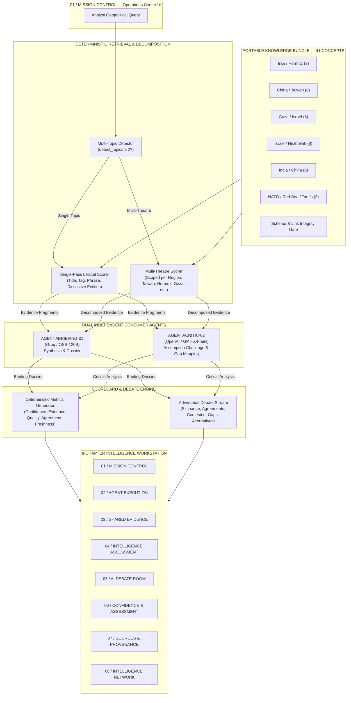

<div align="center">

# OKF Intelligence Operations Center

### Dual-Agent Geopolitical Intelligence Workstation

[](https://github.com/JustXutkarsh/OKF/actions/workflows/ci.yml)
[](https://nextjs.org/)
[](https://www.typescriptlang.org/)
[](https://fastapi.tiangolo.com/)
[](https://python.org/)
[](https://tailwindcss.com/)
[](https://groq.com/)
[](https://openai.com/)
[](https://pytest.org/)
[](https://vitest.dev/)
[](LICENSE)
[](Dockerfile)
[](https://github.com/JustXutkarsh/OKF/security/dependabot)

---

**An open, verifiable, dual-agent geopolitical intelligence workstation engineered for high-stakes strategic analysis.** OKF dispatches two independent, adversarial AI agents — a **Briefing Agent** (Groq / OSS 120B) and a **Critical Analysis Agent** (OpenAI / GPT-5.4-mini) — to analyze the exact same immutable, verified knowledge bundle, cross-examine evidence, challenge assumptions, and debate findings in real time.

[Getting Started](#-getting-started) · [Architecture](#-system-architecture) · [API Reference](#-api-reference) · [Deployment](#-deployment) · [Testing](#-testing--quality-assurance) · [Contributing](#-contributing)

</div>

---

## 📑 Table of Contents

- [The Problem](#-the-problem-why-single-model-approaches-fail)
- [The Solution](#-the-solution-how-okf-is-different)
- [System Architecture](#-system-architecture)
- [Core Subsystems](#-core-subsystems)
  - [1. Knowledge Bundle (`okf/`)](#1-portable-geopolitical-knowledge-bundle-okf)
  - [2. Deterministic Lexical Retriever](#2-deterministic-lexical-retrieval--multi-theatre-decomposition)
  - [3. Consumer A — Briefing Agent](#3-consumer-a--briefing-agent)
  - [4. Consumer B — Critical Analysis Agent](#4-consumer-b--critical-analysis-agent)
  - [5. FastAPI Gateway (`api/`)](#5-fastapi-gateway-layer)
  - [6. Producer (`producer/`)](#6-producer--automated-bundle-updates)
  - [7. Validator (`validator/`)](#7-validator--schema--link-integrity-gate)
  - [8. Frontend Operations Center (`frontend/`)](#8-operations-center-frontend)
  - [9. Codebase Knowledge Graph (`.graphify/`)](#9-codebase-knowledge-graph-graphify)
- [API Reference](#-api-reference)
- [Getting Started](#-getting-started)
  - [Prerequisites](#prerequisites)
  - [Environment Configuration](#1-environment-configuration)
  - [Backend Setup](#2-backend-setup-fastapi)
  - [Frontend Setup](#3-frontend-setup-nextjs-15)
- [Deployment](#-deployment)
  - [Docker](#docker-compose-recommended)
  - [Production Configuration](#production-environment-variables)
- [Testing & Quality Assurance](#-testing--quality-assurance)
- [CI/CD Pipeline](#-cicd-pipeline)
- [Security & Auditability](#-security--auditability)
- [Technology Stack](#-technology-stack)
- [Directory Structure](#-directory-structure)
- [Configuration Reference](#-configuration-reference)
- [Troubleshooting](#-troubleshooting)
- [Contributing](#-contributing)
- [Changelog](#-changelog)
- [License](#-license)

---

## 🎯 The Problem: Why Single-Model Approaches Fail

When analyzing high-stakes geopolitical events — military posture, maritime chokepoint blockades, semiconductor supply chain vulnerabilities, territorial disputes — standard AI approaches fail for fundamental, architectural reasons:

| Failure Mode | Root Cause | Impact |
|---|---|---|
| **Single-LLM Blindspot** | One model has inherent training biases and confirmation bias | Smooth, confident narratives that conceal hidden assumptions |
| **Vector Drift & Semantic Leakage** | Fuzzy embeddings retrieve "sounds similar" documents | Confuses the Taiwan Strait with the Strait of Hormuz due to the word "strait" |
| **Multi-Theatre Query Starvation** | Global ranking lets one topic monopolize all retrieval slots | 5-theatre escalation queries return documents from only 1 region |
| **Zero Provenance** | Hidden retrieval mechanics, no audit trail | Cannot verify which paragraph supported a claim or if facts were fabricated |
| **Chatbot UI Inadequacy** | Sequential conversational bubbles | No side-by-side views, no confidence metrics, no topological insights |

---

## 💡 The Solution: How OKF is Different

OKF shifts the paradigm from a **conversational chatbot** to an **auditable, dual-agent intelligence workstation**:

| Dimension | Standard RAG / Chatbot | OKF Intelligence Operations Center |
|---|---|---|
| **Architecture** | Single LLM model | **Dual Independent Adversarial Agents** (Briefing vs. Critic) |
| **Model Diversity** | Single provider | **Multi-Provider & Multi-Model** (Groq / OSS-120B + OpenAI / GPT-5.4-mini) |
| **Knowledge Store** | Proprietary vector DB | **Immutable, Git-versioned Markdown + YAML** — no vector database required |
| **Retrieval Engine** | Fuzzy vector similarity (drift-prone) | **Deterministic Lexical Engine** with Multi-Theatre Query Decomposition |
| **Cross-Contamination Guard** | None | **Entity Weighting + Dynamic Precision Cutoff** (`cutoff = max(4, 0.35 × top)`) |
| **Critical Review** | Accepts its own output | **Adversarial Critique**: challenges assumptions, maps intelligence gaps |
| **Conflict Resolution** | Suppresses contradictions | **Dedicated AI Debate Room** with verbatim verification |
| **Interface** | Sequential chat bubbles | **Structured 8-Chapter Operations Center** with sticky section navigation |
| **Scoring** | Qualitative text only | **Quantitative Scorecards**: Confidence %, Evidence Quality, Agreement %, Freshness |
| **Network Visualization** | None | **Live Intelligence Graph** + **`.graphify` AST Codebase Knowledge Graph** |

---

## 🏗️ System Architecture


```mermaid
graph TD
    subgraph UI ["01 / MISSION CONTROL — Operations Center UI"]
        UserQuery["Analyst Geopolitical Query"]
    end

    subgraph RETRIEVAL ["DETERMINISTIC RETRIEVAL & DECOMPOSITION"]
        TopicDetector["Multi-Topic Detector<br/>(detect_topics ≥ 2?)"]
        SingleLexical["Single-Pass Lexical Scorer<br/>(Title, Tag, Phrase, Distinctive Entities)"]
        MultiLexical["Multi-Theatre Scorer<br/>(Scoped per Region: Taiwan, Hormuz, Gaza, etc.)"]
        TopicDetector -->|Single Topic| SingleLexical
        TopicDetector -->|Multi-Theatre| MultiLexical
    end

    subgraph BUNDLE ["PORTABLE KNOWLEDGE BUNDLE — 41 CONCEPTS"]
        Hormuz["Iran / Hormuz (8)"]
        Taiwan["China / Taiwan (8)"]
        Gaza["Gaza / Israel (8)"]
        Lebanon["Israel / Hezbollah (8)"]
        IndiaChina["India / China (8)"]
        Context["NATO / Red Sea / Tariffs (3)"]
        Validator["Schema & Link Integrity Gate"]
    end

    subgraph AGENTS ["DUAL INDEPENDENT CONSUMER AGENTS"]
        BriefingAgent["AGENT://BRIEFING-01<br/>(Groq / OSS-120B)<br/>Synthesis & Dossier"]
        CriticAgent["AGENT://CRITIC-02<br/>(OpenAI / GPT-5.4-mini)<br/>Assumption Challenge & Gap Mapping"]
    end

    subgraph ENGINE ["SCORECARD & DEBATE ENGINE"]
        Scorecard["Deterministic Metrics Generator<br/>(Confidence, Evidence Quality, Agreement, Freshness)"]
        DebateStream["Adversarial Debate Stream<br/>(Exchange, Agreements, Contested, Gaps, Alternatives)"]
    end

    subgraph WORKSTATION ["8-CHAPTER INTELLIGENCE WORKSTATION"]
        Sec01["01 / MISSION CONTROL"]
        Sec02["02 / AGENT EXECUTION"]
        Sec03["03 / SHARED EVIDENCE"]
        Sec04["04 / INTELLIGENCE ASSESSMENT"]
        Sec05["05 / AI DEBATE ROOM"]
        Sec06["06 / CONFIDENCE & ASSESSMENT"]
        Sec07["07 / SOURCES & PROVENANCE"]
        Sec08["08 / INTELLIGENCE NETWORK"]
    end

    UserQuery --> TopicDetector
    BUNDLE --> SingleLexical
    BUNDLE --> MultiLexical
    SingleLexical -->|Evidence Fragments| BriefingAgent
    SingleLexical -->|Evidence Fragments| CriticAgent
    MultiLexical -->|Decomposed Evidence| BriefingAgent
    MultiLexical -->|Decomposed Evidence| CriticAgent
    BriefingAgent -->|Briefing Dossier| Scorecard
    CriticAgent -->|Critical Analysis| Scorecard
    BriefingAgent -->|Briefing Dossier| DebateStream
    CriticAgent -->|Critical Analysis| DebateStream
    Scorecard --> WORKSTATION
    DebateStream --> WORKSTATION
```

### Data Flow: End-to-End Request Lifecycle

```
Analyst Query ──► Next.js Frontend (POST /api/v1/compare)
                         │
                         ├── Auth: Bearer token validated (SHA-256 hash comparison)
                         ├── Rate Limit: 60 req/min (SlowAPI)
                         ├── Request ID: UUID attached to all logs
                         │
                         ▼
                  FastAPI Gateway Layer
                         │
              ┌──────────┴──────────┐
              ▼                     ▼
    BriefingService          AnalysisService
              │                     │
              ▼                     ▼
    scan_catalog(okf/)       scan_catalog(okf/)
              │                     │
              ▼                     ▼
    select() ─── Deterministic ─── select()
    Lexical Retriever          Lexical Retriever
              │                     │
              ▼                     ▼
    read_documents()         read_documents()
    (Selected docs only)     (Selected docs only)
              │                     │
    ┌─────────┘                     └─────────┐
    │ NOT_COVERED?                  NOT_COVERED? │
    │ → Skip LLM                   → Skip LLM   │
    ▼                                          ▼
    Groq API                          OpenAI API
    (openai/gpt-oss-120b)            (gpt-5.4-mini)
              │                               │
              ▼                               ▼
    parse_briefing()             parse_analysis()
              │                               │
              │                    verify_conflicts()
              │                    (Verbatim source check)
              │                               │
              ▼                               ▼
    AnswerReport (Briefing)      AnswerReport (Analysis)
              │                               │
              └─────────────┬─────────────────┘
                            ▼
                   ComparisonService
                   (Merge + Metadata)
                            │
                            ▼
                   JSON Response → Frontend
                   (Scorecard, Debate, Evidence, Sources)
```

---

## 🧩 Core Subsystems

### 1. Portable Geopolitical Knowledge Bundle (`okf/`)

The knowledge layer consists of **plain Markdown files with YAML frontmatter** in `okf/` — requiring **no vector database, no external index, and no proprietary SDK**. Every document is Git-versioned, human-readable, and fully auditable.

**Bundle Composition:**

| Cluster | Documents | Coverage |
|---|---|---|
| **Iran / Strait of Hormuz** | 8 | Maritime tensions, oil transit chokepoint (21M bpd), IRGC naval posture, 5th Fleet operations, nuclear enrichment, Gulf states hedging, sanctions evasion, alternative pipelines |
| **China / Taiwan** | 8 | Military tensions, semiconductor supply chain (TSMC), reunification policy, Indo-Pacific alignment, porcupine defense, PLA blockade capabilities, US-Taiwan Relations Act, First Island Chain |
| **Gaza / Israel** | 8 | Humanitarian crisis, military operations, US diplomatic involvement, domestic political cleavages, Hamas posture, post-war governance, Philadelphi Corridor, ceasefire mediation |
| **Israel / Hezbollah / Lebanon** | 8 | Border conflict, Hezbollah arsenal, UNSCR-1701, economic collapse, IDF Northern Command, Axis of Resistance, Radwan Force, civil defense |
| **India / China Border** | 8 | LAC eastern sector, Arunachal Pradesh dispute, border infrastructure (BRO), PLA Western Theater Command, diplomatic negotiations, Galwan aftermath, Tibet airfields, Quad balancing |
| **Strategic Context** | 3 | NATO Article 5, Red Sea shipping disruptions (Houthi), US-China tariff escalation 2026 |
| **Total** | **41** | **129 relationship edges** across clusters |

**Document Schema (YAML Frontmatter):**

```yaml
---
id: strait-of-hormuz-maritime-tensions
title: "Strait of Hormuz Maritime Tensions"
resource: conflicts
confidence: verified
schema_version: 1
tags: [hormuz, iran, maritime, chokepoint, persian-gulf]
related: [hormuz-oil-transit-chokepoint, irgc-navy-gulf-posture, us-fifth-fleet-bahrain-operations]
sources:
  - title: "IISS Strategic Survey 2025"
    url: "https://example.com/source"
    accessed: "2026-06-15"
---

## Summary
Concise summary paragraph...

## Developments
- Development point with date references...

## Key Actors
- **Actor Name**: Role and capabilities...
```

**Directory Structure:**

```
okf/
├── actors/        # Geopolitical actors & command entities
├── conflicts/     # Active conflict zones & tension points
├── economics/     # Trade flows, chokepoints, semiconductors, sanctions
└── policy/        # Treaties, defense doctrines, UN resolutions
```

---

### 2. Deterministic Lexical Retrieval & Multi-Theatre Decomposition

OKF **deliberately avoids vector embeddings**, which suffer from semantic drift, hallucinations, and high operating costs. Instead, it employs a transparent, testable, deterministic multi-stage lexical scorer.

**Five Independent Scoring Signals:**

| Signal | Weight | Function | Purpose |
|---|---|---|---|
| `title_score` | ×4 | Distinct query tokens in document title | Primary relevance indicator |
| `phrase_bonus` | ×5 | Contiguous bigram match in title/id/tags | Preserves proper names ("Strait of Hormuz") |
| `tag_score` | ×3 | Distinct query tokens in document tags | Categorical matching |
| `id_score` | ×2 | Distinct query tokens in kebab-case ID | Document identity matching |
| `resource_score` | ×1 | Distinct query tokens in folder name | Cluster-level matching |

**Key Innovations:**

1. **Distinctive Entity Weighting**: Separates generic descriptors (`strait`, `sea`, `gulf`, `bay`, `fleet`, `defense`) from specific named entities (`hormuz`, `taiwan`, `irgc`, `arunachal`, `hezbollah`). Documents matching distinctive entities receive a +10 bonus, preventing generic modifier collisions across clusters.

2. **Dynamic Relevance Cutoff**:
   ```
   cutoff = max(4, int(top_score × 0.35))
   ```
   Trailing single-modifier noise is discarded, ensuring **0% cross-topic contamination** (e.g., Taiwan documents never appear in pure Hormuz queries).

3. **Multi-Theatre Query Decomposition**:
   - `detect_topics(query)` uses regex patterns against 8 recognized theatre clusters
   - When ≥ 2 theatres are detected, scoring is executed **independently per theatre**
   - Results are deduplicated and merged, guaranteeing balanced representation across all queried regions
   - Example: A 5-theatre escalation query retrieves ~15 documents with coverage across all regions

4. **Out-of-Scope Guardrails**: Questions outside the knowledge bundle trigger `NOT_COVERED` classification with zero evidence — the LLM is **never called** for uncovered topics (cost control rule).

**Recognized Theatre Patterns:**

| Theatre | Detection Pattern | Example Triggers |
|---|---|---|
| Taiwan | `taiwan`, `taiwan strait`, `taipei`, `tsmc` | "What's happening in Taiwan?" |
| Strait of Hormuz | `hormuz`, `persian gulf`, `irgc` | "Hormuz oil transit risk" |
| Gaza | `gaza`, `hamas`, `philadelphi`, `rafah` | "Gaza humanitarian crisis" |
| Israel-Lebanon | `lebanon`, `hezbollah`, `unscr 1701`, `litani` | "Hezbollah missile threat" |
| India-China | `india-china`, `arunachal`, `lac`, `sino-indian` | "LAC border tensions" |
| Red Sea | `red sea`, `houthi`, `bab el-mandeb` | "Red Sea shipping disruption" |
| NATO | `nato`, `eastern flank` | "NATO eastern flank posture" |
| US-China Tariffs | `tariffs`, `export controls` | "2026 tariff escalation" |

---

### 3. Consumer A — Briefing Agent

| Aspect | Detail |
|---|---|
| **Role** | Situation synthesis and structured intelligence dossier |
| **Provider** | Groq API |
| **Models** | `openai/gpt-oss-120b` (default), `llama-3.3-70b-versatile`, `qwen/qwen3.6-27b` |
| **Config Env** | `OKF_CONSUMER_A_PROVIDER`, `OKF_CONSUMER_A_MODEL` |
| **Public Interface** | `ConsumerService.answer(question, max_docs)` → `AnswerReport` |

**Processing Pipeline:**

```
question → scan_catalog(okf/) → select(catalog, question, max_docs)
         → [NOT_COVERED check: skip LLM if empty]
         → read_documents(selected only) → LLM chat(SYSTEM_PROMPT, user_prompt)
         → parse_briefing(raw JSON) → build_report(briefing, docs, retrieval, diagnostics)
         → AnswerReport
```

**Output Contract (`Briefing`):**
- `current_situation` — Executive summary
- `key_developments` — Chronological development list
- `key_actors` — Named actors with roles and capabilities
- `reasoning` — LLM chain-of-thought reasoning

**Key Modules:**

| File | Purpose |
|---|---|
| `service.py` | Orchestration: retrieval → LLM → report assembly |
| `retriever.py` | Deterministic lexical scorer (shared algorithm) |
| `reader.py` | Markdown/YAML bundle parser, frontmatter catalog scanner |
| `llm.py` | Groq API client with resilient error handling |
| `prompts.py` | System and user prompt templates |
| `models.py` | Pydantic schemas for requests, responses, and evidence |
| `config.py` | Environment-driven configuration (provider, model, paths) |

---

### 4. Consumer B — Critical Analysis Agent

| Aspect | Detail |
|---|---|
| **Role** | Assumption challenge, gap mapping, conflicting evidence detection |
| **Provider** | OpenAI API |
| **Models** | `gpt-5.4-mini` (default), `gpt-4o`, `gpt-4o-mini` |
| **Config Env** | `OKF_CONSUMER_B_PROVIDER`, `OKF_CONSUMER_B_MODEL` |
| **Public Interface** | `ConsumerService.analyze(question, max_docs)` → `AnswerReport` |

**Processing Pipeline (extends Consumer A with verification):**

```
question → scan_catalog → select → [NOT_COVERED check]
         → read_documents → LLM chat → parse_analysis
         → verify_conflicts(analysis.conflicting_evidence, documents)
            ├── Verified conflicts retained
            └── Hallucinated conflicts discarded (logged)
         → build_report → AnswerReport
```

**Output Contract (`CriticalAnalysisReport`):**
- `assumptions` — Identified assumptions in the evidence
- `conflicting_evidence` — **Verbatim-verified** contradictions (post-verification)
- `uncertainties` — Acknowledged knowledge gaps
- `alternative_interpretations` — Plausible alternative scenarios
- `missing_information` — Identified intelligence gaps
- `confidence_assessment` — Qualitative confidence judgment

**Key Differentiator: Verbatim Conflict Verification** — Consumer B's claimed conflicts are verified against the actual source documents. Any conflict that cannot be traced to verbatim text in the retrieved evidence is **discarded and logged**, preventing LLM-fabricated contradictions.

---

### 5. FastAPI Gateway Layer

The API layer uses an **application factory pattern** with lifespan-managed resources, following 12-factor app principles.

**Application Factory (`api/main.py`):**

```python
app = create_app()  # Settings → Lifespan → Middleware → Routers
```

**Lifespan Management:**
- **Startup**: Configuration validation (fail-fast), consumer registry construction, service initialization, job manager creation
- **Shutdown**: Job manager stop, pooled HTTP client cleanup, zero resource leaks

**Middleware Stack** (outermost → innermost):

| Layer | Module | Purpose |
|---|---|---|
| Request ID | `middleware/request_id.py` | UUID per request, propagated to all logs |
| Access Logging | `middleware/access_log.py` | Structured access logs with timing |
| Timeout | `middleware/timeout.py` | Configurable per-request timeout (default: 60s) |
| Rate Limiting | `core/ratelimit.py` | SlowAPI enforcement per route |
| CORS | FastAPI built-in | Configurable origins |

**Core Infrastructure:**

| Module | Purpose |
|---|---|
| `core/config.py` | 12-factor environment-driven settings, SHA-256 key hashing |
| `core/security.py` | Bearer token authentication with constant-time hash comparison |
| `core/errors.py` | Structured error envelope (`ErrorEnvelope`) with consistent codes |
| `core/metrics.py` | Prometheus metrics exposition |
| `core/ratelimit.py` | Configurable rate limiting (general: 60/min, producer: 5/min) |
| `services/registry.py` | Consumer adapter registry (dynamically discovers available agents) |
| `services/jobs.py` | Async job manager with retention policies |
| `services/comparison.py` | Parallel consumer execution + deterministic merge |

---

### 6. Producer — Automated Bundle Updates

The Producer agent periodically searches for new evidence and atomically updates the knowledge bundle through a validation gate.

| File | Purpose |
|---|---|
| `cli.py` | CLI interface: `update <concept_id>`, `update --all`, `--dry-run` |
| `search.py` | Tavily Search API integration for live evidence discovery |
| `summarizer.py` | LLM-powered evidence summarization into structured format |
| `updater.py` | Atomic document drafting with pre-write validation gate |
| `writer.py` | Filesystem writer with atomic write guarantees |
| `evidence.py` | Evidence structure and source normalization |
| `validator_adapter.py` | Pre-write validation using the Validator subsystem |
| `config.py` | Environment-driven config (provider, search params, paths) |

**Update Flow:**
```
Tavily Search → Evidence Collection → LLM Summarization
→ Draft Document → Validator Gate → Atomic Write to okf/
```

**Safety Guarantees:**
- Every write passes through the Validator before being committed
- Prior document history is never corrupted
- `--dry-run` mode validates without writing
- Exit code taxonomy for automation (`0` = success, non-zero = specific failures)

---

### 7. Validator — Schema & Link Integrity Gate

The Validator enforces 12 deterministic rules (OKF001–OKF012) on every bundle document:

| File | Purpose |
|---|---|
| `rules.py` | 12 verification rules: YAML schema, confidence levels, URL format, source structure |
| `parser.py` | YAML frontmatter parser with structured error reporting |
| `validator.py` | Orchestrator: runs all rules, aggregates results |
| `cli.py` | CLI: `python -m validator validate okf` |
| `reporter.py` | Human-readable and JSON output formatting |
| `models.py` | Validation result schemas |

**Usage:**
```bash
.venv/bin/python -m validator validate okf
```

---

### 8. Operations Center Frontend

The frontend is a **structured 8-chapter intelligence workstation** built with Next.js 15, React 19, and Tailwind CSS v4 — not a conversational chatbot UI.

**8-Chapter Workstation Layout:**

| Chapter | Section ID | Component | Purpose |
|---|---|---|---|
| **01** | `MISSION CONTROL` | Query input, doc count selector, model provider status, sample presets | Mission configuration |
| **02** | `AGENT EXECUTION` | Live multi-step execution timeline with animated progress bars | Pipeline monitoring |
| **03** | `SHARED EVIDENCE` | Full evidence cards with relevance scores and section anchors | Single source of truth |
| **04** | `INTELLIGENCE ASSESSMENT` | Side-by-side dossiers — Briefing (left) vs. Critique (right) | Comparative analysis |
| **05** | `AI DEBATE ROOM` | Claim vs. challenge comparison with category filters | Conflict resolution |
| **06** | `CONFIDENCE & ASSESSMENT` | Quantitative metrics grid (Confidence %, Quality, Agreement %, Freshness) | Scoring dashboard |
| **07** | `SOURCES & PROVENANCE` | Verified primary sources with outbound links and generation lineage | Audit trail |
| **08** | `INTELLIGENCE NETWORK` | Interactive ReactFlow graph with active mission node highlighting | Network topology |

**Key Components:**

| Component | File | Purpose |
|---|---|---|
| Agent Workspace | `components/agent-workspace.tsx` | Master layout & state coordinator (21 connections, God Node) |
| Briefing View | `components/briefing-view.tsx` | Left column: Groq/OSS-120B dossier |
| Analysis View | `components/analysis-view.tsx` | Right column: OpenAI/GPT-5.4-mini critique |
| Debate Stream | `components/debate-stream.tsx` | Exchange, Agreements, Contested, Gaps, Alternatives |
| Knowledge Graph | `components/knowledge-graph-panel.tsx` | ReactFlow concept graph with active node glow |
| Scorecard | `components/scorecard.tsx` | Quantitative confidence metrics grid |
| Section Nav | `components/section-nav.tsx` | Sticky 8-chapter navigator with IntersectionObserver |
| Error Boundary | `components/error-boundary.tsx` | Isolated error boundary with diagnostics |
| Top Nav | `components/top-nav.tsx` | Navigation bar & granular system status |

**Client Libraries:**

| Library | File | Purpose |
|---|---|---|
| API Client | `lib/api.ts` | Backend REST client (`/brief`, `/analyze`, `/compare`, `/ready`, `/version`) |
| Debate Logic | `lib/debate.ts` | Agreement/conflict classification logic |
| Scorecard Engine | `lib/scorecard.ts` | Metrics calculation engine |
| Graph Loader | `lib/knowledge-graph.ts` | Graph loading with REST → static fallback |
| Static Graph | `lib/bundle-graph.json` | Pre-computed 41-node / 129-edge fallback for serverless deployments |

**UI Design System:**
- Command-center dark navy palette with scanline effects
- Glassmorphism panels with `backdrop-blur-md`
- Terminal green (`hsl(var(--terminal-green))`) for active intelligence nodes
- Framer Motion micro-animations and layout transitions
- Responsive layout with `max-w-[1600px]` container

---

### 9. Codebase Knowledge Graph (`.graphify/`)

OKF includes a **standalone, automated codebase knowledge graph generator** that parses the entire repository's AST structure and produces interactive visualization artifacts.

**Generated Artifacts:**

| Artifact | File | Description |
|---|---|---|
| **Interactive Visualizer** | `.graphify/graph.html` | Standalone dark-themed D3 force-directed graph with search, layer filtering, zoom/pan, degree scaling, and connection inspector |
| **Machine-Readable Graph** | `.graphify/graph.json` | **974 nodes** and **1,490 edges** across 9 subsystem layers |
| **Architecture Report** | `.graphify/GRAPH_REPORT.md` | Topology breakdown, pipeline mappings, high-centrality "God Nodes" |
| **Manifest** | `.graphify/manifest.json` | Schema index of primary system entry points |
| **Generator Script** | `.graphify/generate.py` | Deterministic Python AST + Markdown + TypeScript parser |
| **Viewer Template** | `.graphify/viewer_template.html` | D3.js HTML template (data injected at generation) |

**Graph Composition:**

| Layer | Nodes | | Kind | Count |
|---|---|---|---|---|
| tests | 352 | | test | 229 |
| api | 145 | | function | 210 |
| frontend | 113 | | module | 165 |
| consumer_b | 91 | | class | 150 |
| producer | 89 | | method | 114 |
| consumer_a | 80 | | component | 52 |
| knowledge_bundle | 42 | | concept | 41 |
| validator | 41 | | endpoint | 12 |
| backend | 21 | | bundle | 1 |

**Regeneration:**
```bash
.venv/bin/python .graphify/generate.py
```

---

## 📡 API Reference

All endpoints are prefixed with `/api/v1`. Interactive Swagger documentation is available at `http://localhost:8000/docs`.

### Intelligence Endpoints

| Method | Path | Auth | Rate Limit | Description |
|---|---|---|---|---|
| `POST` | `/api/v1/brief` | Bearer | 60/min | Briefing dossier from Consumer A (Groq) |
| `POST` | `/api/v1/analyze` | Bearer | 60/min | Critical analysis from Consumer B (OpenAI) |
| `POST` | `/api/v1/compare` | Bearer | 60/min | Parallel dual-agent execution + deterministic merge |

**Request Body:**
```json
{
  "question": "What are the current maritime tensions in the Strait of Hormuz?",
  "max_docs": 5
}
```

### Producer Endpoints

| Method | Path | Auth | Rate Limit | Description |
|---|---|---|---|---|
| `POST` | `/api/v1/producer/update` | Bearer | 5/min | Queue async update for one concept (returns `202` + job ID) |
| `POST` | `/api/v1/producer/update-all` | Bearer | 5/min | Queue async update for all tracked concepts |
| `GET` | `/api/v1/jobs` | Bearer | — | List recent producer jobs (newest first) |
| `GET` | `/api/v1/jobs/{job_id}` | Bearer | — | Fetch one job record by ID |

### System Endpoints

| Method | Path | Auth | Description |
|---|---|---|---|
| `GET` | `/api/v1/health` | — | Liveness probe (always `200` if process is running) |
| `GET` | `/api/v1/ready` | — | Readiness probe: bundle, registry, provider configuration (returns `503` if not ready) |
| `GET` | `/api/v1/version` | — | Build info: `app_version`, `git_sha`, `build_time`, `bundle_version`, component versions |
| `GET` | `/api/v1/graph` | — | Knowledge graph: 41 nodes + 129 validated edges from bundle frontmatter |
| `GET` | `/api/v1/metrics` | — | Prometheus text format metrics exposition |

### Error Envelope

All errors follow a consistent structure:

```json
{
  "error": {
    "code": "VALIDATION_ERROR",
    "message": "Question must not be empty.",
    "request_id": "550e8400-e29b-41d4-a716-446655440000"
  }
}
```

| HTTP Code | Error Code | Cause |
|---|---|---|
| `401` | `AUTH_REQUIRED` | Missing or invalid bearer token |
| `422` | `VALIDATION_ERROR` | Invalid request body |
| `429` | `RATE_LIMIT` | Rate limit exceeded |
| `502` | `UPSTREAM_ERROR` | LLM provider failure |
| `504` | `TIMEOUT` | Request timeout exceeded |

---

## 🚀 Getting Started

### Prerequisites

| Requirement | Version | Purpose |
|---|---|---|
| **Python** | 3.11+ | Backend API, consumers, producer, validator |
| **Node.js** | 18+ | Frontend development server |
| **npm** | 9+ | Frontend package management |
| **Groq API Key** | — | Consumer A (Briefing Agent) |
| **OpenAI API Key** | — | Consumer B (Critical Analysis Agent) |
| **Tavily API Key** | Optional | Producer (live evidence search) |

### 1. Environment Configuration

```bash
# Clone the repository
git clone https://github.com/JustXutkarsh/OKF.git
cd OKF

# Create your local environment file
cp .env.example .env
```

Edit `.env` with your API keys:

```env
# Required: At least one agent key
GROQ_API_KEY=gsk_your_groq_api_key
OPENAI_API_KEY=sk-your_openai_api_key

# Optional: Producer search
TAVILY_API_KEY=tvly-your_tavily_key

# Required for API auth (comma-separated bearer tokens):
OKF_API_KEYS=your-secret-bearer-token-1,your-secret-bearer-token-2

# Or disable auth for local development ONLY:
# OKF_API_AUTH_DISABLED=true
```

> **⚠️ Important:** The API will **refuse to start** without either `OKF_API_KEYS` set or `OKF_API_AUTH_DISABLED=true`. This is a deliberate fail-fast safety mechanism.

### 2. Backend Setup (FastAPI)

```bash
# Create and activate Python virtual environment
python3 -m venv .venv
source .venv/bin/activate  # On Windows: .venv\Scripts\activate

# Install pinned production dependencies
pip install -r requirements.txt

# (Optional) Install development tools
pip install -r requirements-dev.txt

# Verify the knowledge bundle passes validation
.venv/bin/python -m validator validate okf

# Start the FastAPI backend server
uvicorn api.main:app --reload --port 8000
```

The API will be available at:
- **Base URL**: `http://localhost:8000`
- **Swagger Docs**: `http://localhost:8000/docs`
- **Readiness Probe**: `http://localhost:8000/api/v1/ready`

### 3. Frontend Setup (Next.js 15)

In a separate terminal window:

```bash
cd frontend

# Install Node dependencies
npm install

# Start Next.js development server
npm run dev
```

Open **`http://localhost:3000`** in your browser to launch the Intelligence Operations Center.

---

## 🐳 Deployment

### Docker Compose (Recommended)

```bash
# Build and run the backend API
docker compose up --build -d

# Verify the container is healthy
docker compose ps
docker compose logs -f api
```

The `compose.yaml` mounts `okf/` and `config/` as volumes so the bundle remains accessible and updatable.

### Docker Build (Manual)

```bash
# Build with provenance metadata
docker build \
  --build-arg OKF_API_GIT_SHA=$(git rev-parse HEAD) \
  --build-arg OKF_API_BUILD_TIME=$(date -u +"%Y-%m-%dT%H:%M:%SZ") \
  -t okf-api:latest .

# Run with environment variables
docker run -d \
  --name okf-api \
  -p 8000:8000 \
  -e OKF_API_KEYS=your-secret-key \
  -e GROQ_API_KEY=gsk_your_key \
  -e OPENAI_API_KEY=sk-your_key \
  -v $(pwd)/okf:/app/okf \
  -v $(pwd)/config:/app/config \
  okf-api:latest
```

**Container Details:**
- Base image: `python:3.11-slim`
- Non-root runtime user (`uid 10001`)
- Built-in healthcheck (30s interval, 5s timeout, 3 retries)
- Graceful shutdown via Uvicorn SIGTERM + lifespan hooks

### Production Environment Variables

| Variable | Required | Default | Description |
|---|---|---|---|
| `GROQ_API_KEY` | Yes¹ | — | Groq API key for Consumer A |
| `OPENAI_API_KEY` | Yes¹ | — | OpenAI API key for Consumer B |
| `TAVILY_API_KEY` | No | — | Tavily search key for Producer |
| `OKF_API_KEYS` | Yes² | — | Comma-separated bearer tokens (stored SHA-256 hashed only) |
| `OKF_API_AUTH_DISABLED` | No | `false` | Dev-only auth bypass (`true`/`false`) |
| `OKF_API_HOST` | No | `0.0.0.0` | Bind address |
| `OKF_API_PORT` | No | `8000` | Bind port |
| `OKF_API_VERSION` | No | `1.0.0` | Reported application version |
| `OKF_API_GIT_SHA` | No | `unknown` | Git commit hash (injected at build) |
| `OKF_API_BUILD_TIME` | No | `unknown` | Build timestamp (injected at build) |
| `OKF_API_REQUEST_TIMEOUT_SECONDS` | No | `60` | Per-request timeout |
| `OKF_API_RATE_LIMIT` | No | `60/minute` | General endpoint rate limit |
| `OKF_API_PRODUCER_RATE_LIMIT` | No | `5/minute` | Producer endpoint rate limit |
| `OKF_API_CORS_ORIGINS` | No | `*` | Comma-separated CORS origins |
| `OKF_API_JOB_RETENTION` | No | `100` | Maximum retained job records |
| `OKF_CONSUMER_A_PROVIDER` | No | `groq` | Consumer A LLM provider |
| `OKF_CONSUMER_A_MODEL` | No | `llama-3.3-70b-versatile` | Consumer A model |
| `OKF_CONSUMER_B_PROVIDER` | No | `openai` | Consumer B LLM provider |
| `OKF_CONSUMER_B_MODEL` | No | `gpt-5.4-mini` | Consumer B model |
| `OKF_PRODUCER_LLM_PROVIDER` | No | `groq` | Producer LLM provider |
| `OKF_PRODUCER_MODEL` | No | `llama-3.3-70b-versatile` | Producer model |
| `OKF_BUNDLE_PATH` | No | `okf` | Path to knowledge bundle |
| `OKF_REGISTRY_PATH` | No | `config/tracked_concepts.yaml` | Tracked concepts registry |
| `OKF_LOG_LEVEL` | No | `INFO` | Log level (`DEBUG`/`INFO`/`WARNING`/`ERROR`) |

¹ Required by whichever component uses that provider
² Required unless `OKF_API_AUTH_DISABLED=true`

---

## 🧪 Testing & Quality Assurance

OKF maintains a comprehensive test suite covering all subsystems with **229 total tests**.

### Backend Test Suite (193 Tests — Pytest)

```bash
# Run the full backend test suite
.venv/bin/pytest

# Run with verbose output
.venv/bin/pytest -v

# Run a specific test module
.venv/bin/pytest tests/test_consumer_a.py
.venv/bin/pytest tests/test_consumer_b.py
.venv/bin/pytest tests/test_api.py
.venv/bin/pytest tests/test_producer.py
.venv/bin/pytest tests/test_validator.py
```

**Test Coverage:**

| Suite | Tests | Scope |
|---|---|---|
| `test_consumer_a.py` | 34 | Lexical retrieval, entity weighting, phrase matching, NOT_COVERED guardrails, service orchestration |
| `test_consumer_b.py` | 37 | Critical analysis, conflict verification, verbatim checks, service orchestration |
| `test_api.py` | 31 | API router contracts, auth enforcement, rate limiting, error envelopes, graph endpoint |
| `test_producer.py` | 38 | Search integration, evidence summarization, atomic writes, dry-run, validation gate |
| `test_validator.py` | — | Schema rules OKF001–OKF012, link integrity, YAML parsing |

### Bundle Validation

```bash
# Validate all 41 bundle documents
.venv/bin/python -m validator validate okf
```

### Frontend Test Suite (36 Tests — Vitest)

```bash
cd frontend

# Run all frontend tests
npm run test:run

# Run in watch mode
npm test

# Run with coverage
npx vitest run --coverage
```

**Test Coverage:**
- Error boundary isolation and diagnostics
- Agent lifecycle management
- Scorecard debate calculations
- Knowledge graph fallback resolution (REST → static)
- Shared state execution
- Component rendering

### TypeScript Compilation

```bash
cd frontend && npx tsc --noEmit
```

### Production Build Verification

```bash
cd frontend && npm run build
```

---

## 🔄 CI/CD Pipeline

GitHub Actions CI runs on every push to `main` and all pull requests:

```
quality-gate (Job 1)
├── Checkout + Python 3.11 setup
├── Dependency caching (pip)
├── Install production dependencies (pinned)
├── Install development dependencies (pinned)
├── Ruff (linting)
├── Black --check (formatting)
├── mypy (type checking)
├── Unit tests (all backend tests)
├── Bundle validation (okf/)
├── pip-audit (vulnerability scanning)
└── Upload test results (14-day retention)

docker-build (Job 2, depends on quality-gate)
├── Docker Buildx setup
├── Build image with provenance args (git SHA, timestamp)
├── GHA build cache (cache-from/cache-to)
└── No push (build verification only)
```

**Additional Automation:**
- **Dependabot**: Weekly dependency updates (pip + GitHub Actions), Monday schedule, grouped PRs
- **Pre-commit hooks**: `trailing-whitespace`, `end-of-file-fixer`, Ruff (auto-fix), Black

### Setting Up Pre-commit Locally

```bash
pip install pre-commit
pre-commit install
```

---

## 🔒 Security & Auditability

### Authentication & Authorization

- **Bearer Token Auth**: All intelligence and producer endpoints require a `Bearer` token
- **SHA-256 Hashed Storage**: API keys are SHA-256 hashed on startup; plaintext keys are immediately discarded and **never stored**
- **Constant-Time Comparison**: Token validation uses constant-time hash comparison to prevent timing attacks
- **Fail-Fast Boot**: API refuses to start without an explicit authentication decision (`OKF_API_KEYS` set or `OKF_API_AUTH_DISABLED=true`)

### Evidence Provenance

- **Zero Fabricated Evidence**: Every claim is tied to verified Markdown source files in `okf/`
- **Verbatim Conflict Verification**: Consumer B's claimed conflicts are verified against source text; fabrications are discarded
- **Git Auditability**: The knowledge layer is Git-versioned — every change is diffable and traceable
- **Request Tracing**: UUID request IDs propagated through all logs and error envelopes

### Operational Security

- **Non-Root Container**: Docker container runs as user `okf` (UID 10001)
- **No Secret Logging**: API keys, tokens, and sensitive data are never logged (hash prefixes only)
- **Rate Limiting**: Configurable per-route rate limiting (general: 60/min, producer: 5/min)
- **Request Timeout**: Configurable per-request timeout (default: 60s)
- **Dependency Auditing**: `pip-audit` runs in CI on every commit
- **Atomic Bundle Writes**: Producer updates pass through the Validator before writing; prior history is never corrupted

### Offline & Air-Gapped Operation

The knowledge bundle and deterministic lexical retriever run locally with **zero reliance on cloud vector databases**. The system is operational in air-gapped environments (LLM API access still required for agent analysis).

---

## 🛠️ Technology Stack

### Backend

| Technology | Version | Purpose |
|---|---|---|
| [Python](https://python.org/) | 3.11+ | Runtime |
| [FastAPI](https://fastapi.tiangolo.com/) | ≥ 0.110 | Web framework with async support |
| [Pydantic](https://docs.pydantic.dev/) | v2 | Data validation and serialization |
| [Uvicorn](https://www.uvicorn.org/) | ≥ 0.29 | ASGI server |
| [OpenAI SDK](https://github.com/openai/openai-python) | ≥ 1.40 | LLM client (Groq + OpenAI) |
| [SlowAPI](https://github.com/laurentS/slowapi) | ≥ 0.1.9 | Rate limiting |
| [Prometheus Client](https://github.com/prometheus/client_python) | ≥ 0.20 | Metrics exposition |
| [HTTPX](https://www.python-httpx.org/) | ≥ 0.27 | HTTP client |
| [PyYAML](https://pyyaml.org/) | ≥ 6.0 | YAML parsing |
| [Tavily Python](https://github.com/tavily-ai/tavily-python) | ≥ 0.5 | Search API |

### Frontend

| Technology | Version | Purpose |
|---|---|---|
| [Next.js](https://nextjs.org/) | 15.5 | App Router, React 19 framework |
| [React](https://react.dev/) | 19.1 | UI library |
| [TypeScript](https://www.typescriptlang.org/) | 5.0 | Type-safe development |
| [Tailwind CSS](https://tailwindcss.com/) | v4 | Utility-first styling |
| [Framer Motion](https://www.framer.com/motion/) | 13.0 | Animations and transitions |
| [TanStack Query](https://tanstack.com/query/latest) | v5 | Server state caching |
| [ReactFlow](https://reactflow.dev/) | 11.11 | Interactive graph visualization |
| [Radix UI](https://www.radix-ui.com/) | — | Accessible UI primitives |
| [Lucide React](https://lucide.dev/) | — | Icon library |
| [Zod](https://zod.dev/) | v4 | Schema validation |

### AI & Intelligence

| Agent | Provider | Default Model | Role |
|---|---|---|---|
| `AGENT://BRIEFING-01` | Groq | `openai/gpt-oss-120b` | Situation synthesis |
| `AGENT://CRITIC-02` | OpenAI | `gpt-5.4-mini` | Assumption challenge |
| Producer | Groq | `llama-3.3-70b-versatile` | Evidence summarization |

### Development & Quality

| Tool | Purpose |
|---|---|
| [Ruff](https://docs.astral.sh/ruff/) | Python linting (E, F, I, W, UP rules) |
| [Black](https://black.readthedocs.io/) | Python formatting (line-length: 100) |
| [mypy](https://mypy-lang.org/) | Static type checking |
| [Pytest](https://pytest.org/) | Backend testing |
| [Vitest](https://vitest.dev/) | Frontend testing |
| [Playwright](https://playwright.dev/) | E2E testing (available) |
| [pip-audit](https://github.com/pypa/pip-audit) | Dependency vulnerability scanning |
| [pre-commit](https://pre-commit.com/) | Git hook automation |
| [Dependabot](https://github.com/dependabot) | Automated dependency updates |

---

## 📂 Directory Structure

```
OKF/
├── .github/                        # CI/CD & automation
│   ├── workflows/ci.yml            # GitHub Actions: lint → typecheck → test → validate → audit → Docker build
│   └── dependabot.yml              # Weekly dependency updates (pip + Actions)
│
├── .graphify/                      # Codebase & Intelligence Architecture Graph
│   ├── generate.py                 # Deterministic AST + Markdown + TS graph generator
│   ├── graph.html                  # Standalone interactive D3 force-directed visualizer
│   ├── graph.json                  # Machine-readable graph (974 nodes, 1,490 edges)
│   ├── GRAPH_REPORT.md             # Topology report & God Node analysis
│   ├── manifest.json               # Graph metadata & entry point registry
│   └── viewer_template.html        # D3.js visualizer HTML template
│
├── api/                            # FastAPI Gateway Layer
│   ├── main.py                     # App factory, lifespan, middleware stack
│   ├── core/
│   │   ├── config.py               # 12-factor environment-driven settings
│   │   ├── errors.py               # Structured ErrorEnvelope + exception handlers
│   │   ├── logging.py              # Structured JSON logging
│   │   ├── metrics.py              # Prometheus metrics
│   │   ├── ratelimit.py            # SlowAPI rate limiting
│   │   └── security.py             # Bearer auth with SHA-256 hash comparison
│   ├── middleware/
│   │   ├── access_log.py           # Request/response access logging
│   │   ├── request_id.py           # UUID per-request propagation
│   │   └── timeout.py              # Configurable request timeout
│   ├── models/                     # Pydantic request/response schemas
│   ├── routers/
│   │   ├── brief.py                # POST /brief (Consumer A)
│   │   ├── analyze.py              # POST /analyze (Consumer B)
│   │   ├── compare.py              # POST /compare (dual-agent parallel)
│   │   ├── producer.py             # POST /producer/update, /update-all (async jobs)
│   │   ├── jobs.py                 # GET /jobs, /jobs/{id}
│   │   └── system.py               # GET /health, /ready, /version, /graph, /metrics
│   └── services/
│       ├── briefing.py             # BriefingService (Consumer A adapter)
│       ├── analysis.py             # AnalysisService (Consumer B adapter)
│       ├── comparison.py           # ComparisonService (parallel merge)
│       ├── consumer_call.py        # Shared consumer invocation logic
│       ├── jobs.py                 # Async JobManager with retention
│       ├── producer_jobs.py        # Producer job submission service
│       └── registry.py             # Consumer adapter registry
│
├── consumer_a/                     # Briefing Agent (Groq / OSS-120B)
│   ├── config.py                   # Environment-driven configuration
│   ├── llm.py                      # Groq API client with error handling
│   ├── models.py                   # Pydantic schemas (AnswerReport, Briefing, Evidence)
│   ├── prompts.py                  # System & user prompt templates
│   ├── reader.py                   # Markdown/YAML bundle parser
│   ├── renderer.py                 # CLI output renderer
│   ├── retriever.py                # Deterministic multi-theatre lexical retriever
│   ├── service.py                  # ConsumerService.answer() orchestrator
│   ├── observability.py            # Stage timers and structured logging
│   └── exceptions.py              # Domain exceptions
│
├── consumer_b/                     # Critical Analysis Agent (OpenAI / GPT-5.4-mini)
│   ├── config.py                   # Environment-driven configuration
│   ├── llm.py                      # OpenAI API client with error handling
│   ├── models.py                   # Pydantic schemas (CriticalAnalysis, AnswerReport)
│   ├── prompts.py                  # System & user prompt templates
│   ├── reader.py                   # Markdown/YAML bundle parser
│   ├── renderer.py                 # CLI output renderer
│   ├── retriever.py                # Deterministic multi-theatre lexical retriever
│   ├── service.py                  # ConsumerService.analyze() orchestrator
│   ├── verifier.py                 # Verbatim conflict verification engine
│   ├── observability.py            # Stage timers and structured logging
│   └── exceptions.py              # Domain exceptions
│
├── producer/                       # Producer Agent (Tavily → LLM → Atomic write)
│   ├── cli.py                      # CLI: update, update --all, --dry-run
│   ├── config.py                   # Environment-driven configuration
│   ├── search.py                   # Tavily search API integration
│   ├── summarizer.py               # LLM-powered evidence summarization
│   ├── updater.py                  # Atomic document drafting + validation gate
│   ├── writer.py                   # Filesystem atomic writer
│   ├── evidence.py                 # Evidence structure & source normalization
│   ├── validator_adapter.py        # Pre-write validation adapter
│   ├── models.py                   # Pydantic schemas
│   ├── prompts.py                  # LLM prompt templates
│   ├── renderer.py                 # CLI output renderer
│   ├── observability.py            # Structured logging
│   └── exceptions.py              # Domain exceptions (exit code taxonomy)
│
├── validator/                      # Schema & Link Integrity Gate
│   ├── cli.py                      # CLI: python -m validator validate okf
│   ├── rules.py                    # 12 verification rules (OKF001–OKF012)
│   ├── parser.py                   # YAML frontmatter parser
│   ├── validator.py                # Rule orchestrator
│   ├── reporter.py                 # Human + JSON output formatter
│   ├── models.py                   # Validation result schemas
│   └── exceptions.py              # Validation exceptions
│
├── okf/                            # Portable Geopolitical Knowledge Bundle
│   ├── actors/                     # Geopolitical actors & command entities
│   ├── conflicts/                  # Active conflict zones & tension points
│   ├── economics/                  # Trade flows, chokepoints, semiconductors
│   └── policy/                     # Treaties, defense doctrines, UN resolutions
│
├── config/
│   └── tracked_concepts.yaml       # Producer concept registry & metadata
│
├── frontend/                       # Next.js 15 Intelligence Operations Center
│   ├── app/                        # App Router (page.tsx, layout.tsx, api/graph/route.ts)
│   ├── components/                 # 8-Chapter Workstation UI components
│   ├── lib/                        # Client libraries (API, debate, scorecard, graph)
│   ├── tests/                      # Vitest regression suite (36 tests)
│   ├── public/                     # Static assets
│   ├── package.json                # Dependencies & scripts
│   ├── vitest.config.ts            # Test configuration
│   └── tsconfig.json               # TypeScript configuration
│
├── tests/                          # Backend Python test suites (193 tests)
│   ├── test_api.py                 # API router & graph endpoint tests
│   ├── test_consumer_a.py          # Briefing retriever & service tests
│   ├── test_consumer_b.py          # Critic retriever & service tests
│   ├── test_producer.py            # Producer search & write tests
│   └── test_validator.py           # Schema & link integrity tests
│
├── .env.example                    # Environment template (committed)
├── .pre-commit-config.yaml         # Pre-commit hooks (Ruff, Black, trailing whitespace)
├── compose.yaml                    # Docker Compose (API + healthcheck)
├── Dockerfile                      # Multi-stage Python 3.11-slim build
├── pyproject.toml                  # Black, Ruff, mypy configuration
├── requirements.in                 # Human-maintained production deps
├── requirements.txt                # Pinned production deps (pip-compile)
├── requirements-dev.in             # Human-maintained dev deps
├── requirements-dev.txt            # Pinned dev deps (pip-compile)
├── CHANGELOG.md                    # Keep a Changelog format
└── README.md                       # This file
```

---

## ⚙️ Configuration Reference

### Consumer Configuration

Both consumers use independent, environment-driven configuration. Switching providers or models requires **zero code changes**.

```env
# Consumer A (Briefing Agent)
OKF_CONSUMER_A_PROVIDER=groq           # groq | openai
OKF_CONSUMER_A_MODEL=openai/gpt-oss-120b

# Consumer B (Critical Analysis Agent)
OKF_CONSUMER_B_PROVIDER=openai         # groq | openai
OKF_CONSUMER_B_MODEL=gpt-5.4-mini
```

> **Architecture Rule:** Producer, Consumer A, and Consumer B are **fully independent** components. They share nothing but the `okf/` bundle directory — no code, no database, no LLM provider coupling.

### Producer Configuration

```env
OKF_PRODUCER_LLM_PROVIDER=groq
OKF_PRODUCER_MODEL=llama-3.3-70b-versatile
OKF_LOOKBACK_DAYS=7                    # Search lookback window
OKF_MAX_RESULTS=5                      # Max search results per concept
OKF_REQUEST_TIMEOUT=30                 # Search request timeout (seconds)
```

### Linting & Formatting

Configured in `pyproject.toml`:
- **Ruff**: `line-length = 100`, `target-version = 'py311'`, rules: `E, F, I, W, UP`
- **Black**: `line-length = 100`, `target-version = ['py311']`
- **mypy**: `python_version = 3.11`, `warn_unreachable = true`, `show_error_codes = true`

---

## 🔧 Troubleshooting

### API Refuses to Start

```
RuntimeError: OKF_API_KEYS is empty and OKF_API_AUTH_DISABLED is not set
```

**Solution:** Set `OKF_API_KEYS=your-token` in `.env`, or set `OKF_API_AUTH_DISABLED=true` for local development only.

### Readiness Probe Returns 503

Check `GET /api/v1/ready` for detailed diagnostics:
- `bundle_accessible`: Can the API read `okf/`?
- `registry_loads`: Can the producer config load `config/tracked_concepts.yaml`?
- `consumers.*.client_ready`: Is the LLM API key valid for each consumer?

### Consumer Returns NOT_COVERED

The question didn't match any documents in the knowledge bundle. This is by design — the system will not fabricate answers. Verify the question relates to one of the 8 recognized theatre clusters.

### Cross-Topic Contamination in Retrieval

If a Hormuz query returns Taiwan documents (or vice versa), verify the lexical retriever's `MODIFIERS` and `THEATRE_PATTERNS` sets are up to date. Run:
```bash
.venv/bin/pytest tests/test_consumer_a.py -k "contamination" -v
```

---

## 🤝 Contributing

1. **Fork** the repository
2. **Create** a feature branch (`git checkout -b feature/your-feature`)
3. **Install** pre-commit hooks: `pre-commit install`
4. **Make** your changes with tests
5. **Run** the full quality gate locally:
   ```bash
   ruff check .
   black --check .
   mypy
   .venv/bin/pytest
   .venv/bin/python -m validator validate okf
   cd frontend && npm run test:run && npx tsc --noEmit
   ```
6. **Commit** (`git commit -m 'feat: add new feature'`)
7. **Push** and open a Pull Request

---

## 📋 Changelog

See [CHANGELOG.md](CHANGELOG.md) for a detailed history of changes. This project follows [Keep a Changelog](https://keepachangelog.com/en/1.1.0/) and [Semantic Versioning](https://semver.org/).

---

## 📄 License

Distributed under the MIT License. See [LICENSE](LICENSE) for more information.

---

<div align="center">

Built with precision for high-stakes geopolitical intelligence analysis.

**[JustXutkarsh/OKF](https://github.com/JustXutkarsh/OKF)**

</div>
